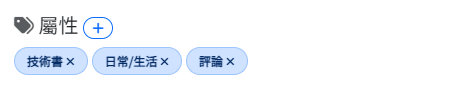
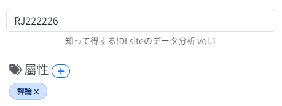
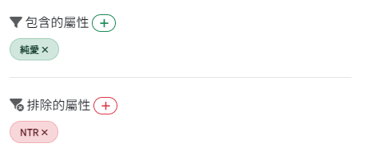

<h1 align="center">DLfilter</h1>

<p align="center">
  <b>依作品給人的感覺，而不只是名稱，來尋找 DLsite 作品。</b><br>
  DLsite 的標籤語義搜尋引擎，附帶快速的本機作品搜尋、四種語言與一鍵 Docker。
</p>

<p align="center">
  
  
  
  
  
  <a href="LICENSE"></a>
</p>

<p align="center">
  <a href="README.md">English</a> | <a href="README.jp.md">日本語</a> | 正體中文 | <a href="README.zh-cn.md">简体中文</a> | <a href="https://dlfilter.moe/">Demo</a>
</p>

> Demo：[https://dlfilter.moe/](https://dlfilter.moe/)（隨時可能下線）

DLfilter 將 DLsite 的標籤（類型，例如 `治癒`、`純愛`）當作詞語做嵌入，因此即使兩部作品沒有任何相同標籤，也能找到類型在*語意上相近*的作品。它也能依標題、社團名稱或 RJ 編號搜尋本機資料庫，並能從任何一筆結果開始相似作品搜尋。

本儲存庫是 [charasleeping](https://github.com/charasleeping/DLfilter) 對 [snowmeow2 的 DLfilter](https://github.com/snowmeow2/DLfilter) 的重啟分支。相似度搜尋與構想皆出自原作者；本分支讓它能在目前的 Python 與函式庫上運作，並加入了[本分支的新功能](#本分支的新功能)中列出的項目。

DLfilter 是為*個人使用*與學習目的而做的小專案，不一定會定期維護。歡迎自由 fork 或發 PR。

## 目錄
[功能](#功能) | [本分支的新功能](#本分支的新功能) | [安裝](#安裝) | [使用方式](#使用方式) | [HTTP API](#http-api) | [開發藍圖](#開發藍圖) | [已知問題](#已知問題) | [致謝](#致謝)

## 功能

### 搜尋
| | |
| --- | --- |
| **尋找作品** | 依標題、社團名稱或 RJ 編號搜尋本機資料庫。不分全形半形與大小寫，且每個詞都必須符合。 |
| **尋找相似作品** | 依一組類型或指定作品搜尋，並依類型的語義相似度排序。 |
| **隨機作品** | 從資料庫隨機抽出作品，可依年齡分級篩選（在**尋找相似作品**分頁則套用其所有篩選條件）。 |
| **從任何結果尋找相似作品** | 點一下結果即可把其 RJ 編號、類型與作品形式帶入**尋找相似作品**分頁。 |

### 調整結果
- 依熱門程度加權類型（偏好冷門或熱門的類型）。
- 依下載數與發售日期加權結果。
- 納入或排除特定類型，並可依作品形式篩選。
- 依年齡分級（全年齡 / R15 / R18）篩選，並可排除 AI 生成、部分 AI 生成、低評價、獵奇或男同性戀作品。

### 好用的細節
- **預設組**：儲存整組搜尋設定（RJ 編號、類型、作品形式、進階選項），之後再載入，也可從任何位置開啟預設組檔案。
- **四種語言**：一鍵切換英文、日文、正體中文與簡體中文。類型與作品形式名稱採用 DLsite 官方翻譯，介面用詞也依循 DLsite。
- **亮色與暗色主題**，附平滑轉場。語言與主題都會由瀏覽器記住。
- 在自己的電腦上以本機 SQLite 資料庫執行，也提供 Docker 設定。

DLfilter *無法*依熱門程度搜尋作品，因為那需要即時更新的資料庫，而這是不可能的（顯然無法存取 DLsite 的資料庫）。但是，我相信熱門的不一定是你想要的。

## 本分支的新功能
與 [snowmeow2/DLfilter](https://github.com/snowmeow2/DLfilter) 相比：

| 項目 | 原版 | 本分支 |
| --- | --- | --- |
| **搜尋** | 僅有相似度搜尋 | 新增**尋找作品**（標題 / 社團 / RJ 編號，含排序）、**隨機作品**，以及從任何結果**尋找相似作品** |
| **介面** | 單一搜尋面板；語言依瀏覽器 | 分頁式搜尋面板、重設與隨機按鈕、**語言切換**（EN / JA / zh-TW / zh-CN，採用 DLsite 用詞）、亮暗主題、預設組 |
| **預設組** | 無 | 以 JSON 檔儲存、載入與匯入搜尋設定（含驗證，最多 200 個） |
| **Python** | 3.10 | **3.11 - 3.14**，支援 Linux、macOS 與 Windows |
| **相依套件** | 未鎖定版本的 `requirements.txt` | `pyproject.toml` + `uv.lock`（鎖定版本）、供 pip 使用的自動產生 `requirements.txt`、Linux 使用僅 CPU 的 PyTorch |
| **執行方式** | `uvicorn app:app` | 另可用 `python app.py`、以 `DLFILTER_*` 環境變數設定、路徑不受工作目錄影響 |
| **Docker** | 無 | `Dockerfile` 與 `compose.yaml`（非 root、唯讀資料庫、預設組磁碟區、可選的離線 `update` 工作） |
| **資料庫安全** | 直接就地寫入 | 網站使用唯讀連線；匯出先寫入暫存檔、檢查後再以 `.bak` 備份換入 |
| **爬取** | 無限重試 | 請求逾時、有上限的指數退避、爬取超過 31 天前需要確認 |
| **模型** | 需要時才下載 | 可從本機模型資料夾完全離線執行；為預設模型的 tokenizer 固定 `transformers<5` |
| **執行時負擔** | 匯入 `sentence-transformers` | 網站不再匯入它（以 PyTorch 計算餘弦相似度），只有 `initial.py` 需要 |
| **診斷** | 無 | `python -m module.doctor` 檢查版本、路徑、資料，加上 `--model` 時還會檢查嵌入模型 |
| **測試** | 無 | 以小型暫存資料庫執行的 75 個 `pytest` 測試，由 GitHub Actions 在 Linux、macOS 與 Windows（Python 3.11 - 3.14）上執行 |
| **修正** | 使用已棄用的 Pydantic / FastAPI / pandas 呼叫 | 更新至目前版本；靜態檔案依修改時間更新快取；錯誤回應不再洩漏內部訊息 |

`recover_works_table_download.py` 還能在不動原檔的情況下，從被截斷的 `works_table.json`（例如下載中斷後）中救回完整的記錄。

## 安裝
以下說明適合想自行架設的人（尤其是我的 Demo 掛掉時）。
如果只是想使用 DLfilter，請直接前往 [https://dlfilter.moe/](https://dlfilter.moe/)。

支援 Python 3.11 – 3.14（已在 Linux、macOS 與 Windows 測試）。

1. 複製儲存庫：
```bash
git clone https://github.com/charasleeping/DLfilter
cd DLfilter
```

2. 安裝相依套件。可使用 [uv](https://docs.astral.sh/uv/)（建議，使用 `uv.lock` 中鎖定的版本）：
```bash
uv sync --extra update     # 只執行網站的話可省略 "--extra update"
```
或在虛擬環境中使用 pip：
```bash
python -m venv .venv
source .venv/bin/activate          # Windows PowerShell：.venv\Scripts\Activate.ps1
pip install -r requirements.txt
```
`update` 額外套件（已包含在 `requirements.txt`）只有 `initial.py` 會用到。Linux 上會安裝僅 CPU 的 PyTorch。

3. 初始化資料庫。有兩種方式：
- 從**[這裡](https://drive.google.com/file/d/1Jod-iFufGW3lIyqttlws9hOqK4k79ha8/view?usp=sharing)**下載預先建好的資料庫，並將內容解壓縮到 `DLfilter/database/`（約 130 MB，解壓縮後約 1 GB）
> 預先建好的資料庫更新至 2023-07-10。你之後可能想要[自行更新](docs/database.zh-tw.md#更新資料庫)。

- 自行初始化資料庫。請參閱[這裡](docs/database.zh-tw.md#初始化資料庫)。

4. 檢查設定（選用）。會顯示版本、路徑與資料庫狀態；加上 `--model` 還會離線載入嵌入模型：
```bash
uv run python -m module.doctor     # 或：python -m module.doctor
```

5. 啟動伺服器
```bash
uv run python app.py               # 或：python app.py
# 等同於：uvicorn app:app --port 8000
```
接著就能在 `http://localhost:8000/` 開啟網站。

### 設定
所有設定都是選用的環境變數：

| 變數 | 預設值 | 說明 |
| --- | --- | --- |
| `DLFILTER_DATA_DIR` | `./database` | 存放 `works.sqlite` 與類型檔案的目錄 |
| `DLFILTER_PRESETS_DIR` | `./presets` | 儲存預設組的目錄 |
| `DLFILTER_HOST` | `127.0.0.1` | `python app.py` 監聽的位址 |
| `DLFILTER_PORT` | `8000` | `python app.py` 監聽的連接埠 |
| `DLFILTER_MODEL` | `sonoisa/sentence-luke-japanese-base-lite` | `initial.py` 使用的嵌入模型：Hugging Face ID 或本機目錄 |

### Docker
映像檔只提供既有的資料庫，啟動時不會下載或爬取任何東西。它以非 root 使用者執行，以唯讀方式掛載 `./database`，並把預設組存放在具名磁碟區。
```bash
docker compose up -d               # 於 http://localhost:8000/ 提供服務（綁定 127.0.0.1）
```
若要在容器中使用本機模型（不下載模型）更新資料庫，請參閱 [compose.yaml](compose.yaml) 中的 `update` 服務。

### 測試
```bash
uv run pytest
```
測試使用小型暫存資料庫，不需要真實資料或模型。GitHub Actions 會在 Linux、macOS 與 Windows 上以 Python 3.11 與 3.14 執行（Linux 另含 3.12 與 3.13）。

## 使用方式
DLfilter 非常容易使用。你可以依**類型**或**指定作品**搜尋相似作品。經驗上，相似度超過 70% 的作品通常彼此相關。

### 以標題、社團或 RJ 編號尋找作品
使用搜尋面板的**尋找作品**分頁。選擇搜尋範圍（全部、標題、社團或 RJ 編號）與年齡分級，然後按 Enter。
- 每個詞都必須符合。不分全形半形與大小寫。
- 完全符合的 RJ 編號排最前，其次是完全相同的標題、以輸入文字開頭的標題，最後是其餘結果。
- 對結果按**尋找相似作品**，會把它的 RJ 編號、類型與作品形式帶入**尋找相似作品**分頁，你可以調整後再開始相似度搜尋。
- **骰子**按鈕會依所選年齡分級顯示隨機作品。重設按鈕會清除所有搜尋並回到歡迎頁面。

此搜尋*僅限本機資料庫*，因此不會知道上次更新後才發售的作品，也不含 DLsite 其他分類的作品（只收集 `maniax`）。結果不是依相似度排序，所以不顯示相似度分數。

### 依相似類型
> **重要**：在此加入的類型*不一定*會出現在搜尋結果中，因為它們是搜尋的「種子」。

加入你喜歡的類型。DLfilter 會把它們當作搜尋查詢（取所加入類型詞嵌入的平均值），並回傳類型相近的作品。

建議加入 2-6 個類型。太多或太少都可能得不到最好的結果。



### 依指定作品
如果你不知道要加入哪些類型，可以改用作品搜尋。只要輸入 RJ 編號（例如 `RJ123456`），DLfilter 就會自動取得它的類型並回傳相似作品。

若該編號不在本機資料庫中，可能是資料庫過舊、記錄遺失，或該作品屬於 DLsite 的其他分類。



### 篩選類型
如果有些類型必須包含或排除在結果中，可以在「包含的類型」與「排除的類型」欄位設定。



請注意，在此設定的類型*不是*用來搜尋的類型，只用來篩選結果。

### 預設組
**尋找相似作品**分頁中**搜尋**旁的按鈕可儲存與載入 RJ 編號、類型、作品形式與進階選項。預設組是專案 `presets/` 資料夾中的 JSON 檔（設定 `DLFILTER_PRESETS_DIR` 可改用其他資料夾；Docker 設定把它們存放在 `presets` 磁碟區）。**載入預設組**會列出該資料夾的內容，也能從其他位置開啟預設組檔案。

### 隨機作品
在**搜尋**下方，**隨機**會依你所在分頁的篩選條件顯示隨機作品，**重設**則會清除所有內容並回到歡迎頁面。

### 語言與主題
右上角的圓形按鈕可切換語言（英文、日文、正體中文、簡體中文，然後回到英文）與亮暗主題。若沒有儲存過選擇，DLfilter 會使用瀏覽器的語言。

## HTTP API
網站是 JSON API 的輕量用戶端，因此你可以用腳本呼叫它。伺服器執行時，互動式文件位於 `/docs`。

| 端點 | 說明 |
| --- | --- |
| `GET /api/info` | 資料庫的作品數量與最後更新時間 |
| `GET /api/locale/{locale}` | 類型與作品形式名稱（`en_US`、`ja_JP`、`zh_TW`、`zh_CN`、`ko_KR`） |
| `GET /api/works?rj_id=...` | 最多 50 部作品的詳細資料；未知的編號列在 `missing` |
| `GET /api/search` | 含年齡篩選與分頁的標題 / 社團 / RJ 編號搜尋 |
| `GET /api/random` | 隨機作品，可搭配相似度搜尋的篩選條件 |
| `POST /api/similarity` | 依類型或指定作品的相似度搜尋 |
| `GET /api/presets`、`GET` / `PUT /api/presets/{name}` | 列出、讀取與儲存預設組 |

## 開發藍圖
- [x] ~~Demo 網站~~
- [] 自動更新資料庫
- [] 更好的 UI
- [x] ~~Docker 化~~
- [] 更完善的文件
- [] 負向搜尋
- [x] ~~依標題、社團與 RJ 編號搜尋~~
- [x] ~~預設組、隨機作品與語言切換~~
- [] DLsite 的其他分類
- [] 進階標籤權重
- [] 個人化搜尋
- [] ???

## 已知問題
- 類型 `おやじ`、`少女コミック`、`少年コミック`、`女性コミック`、`青年コミック` 無法搜尋，因為它們在 DLsite API 中沒有在地化名稱。
- 部分類型的數量可能不正確。

## 致謝
- 原始專案與相似度搜尋：[snowmeow2](https://github.com/snowmeow2/DLfilter)，另有 [AnavRinTW](https://github.com/AnavRinTW) 的貢獻。
- 由 [charasleeping](https://github.com/charasleeping/DLfilter) 重啟並擴充。
- 類型與作品形式的名稱和用詞依循 [DLsite](https://www.dlsite.com/) 的官方翻譯。DLfilter 是非官方工具，與 DLsite 無關。
- 預設嵌入模型：[sonoisa/sentence-luke-japanese-base-lite](https://huggingface.co/sonoisa/sentence-luke-japanese-base-lite)。

以 [MIT 授權](LICENSE)釋出。
